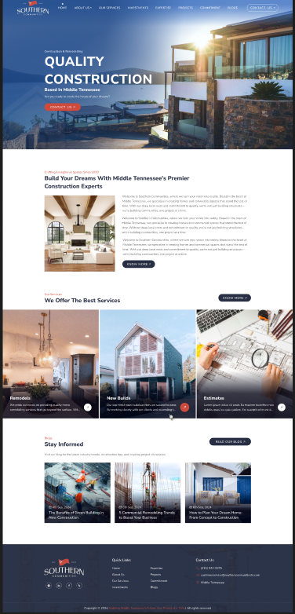

# Southern Company Website

This repository contains the **responsive web version** of the Southern company website, converted from a Figma design using **HTML and CSS**.

## Features

- Modern HTML5 structure and semantic tags
- Styled using CSS3
- Includes header, footer, sections, and content based on the Figma design

## Project Structure

southern-company-website/
│
├─ index.html # Main HTML file

│ -style.css # Main stylesheet
├─ images/ # Images used in the website
└─ README.md # Project documentation

Author
Pritam Mondal

## Preview

